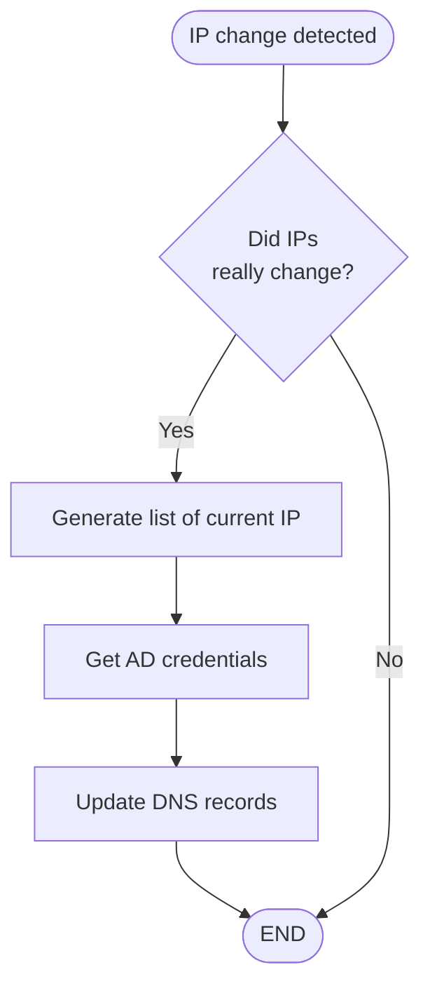

First Pseudocode.

This Pseudocode is very high level. Going in very low amount of details.
# Pseudocode
1. Wait until an IP change is detected.
2. Verify the IP change actually happened.
3. Obtain a list of all current IP.
4. Obtain AD credentials.
5. Update all DNS records for device.
6. end

# FlowChart
